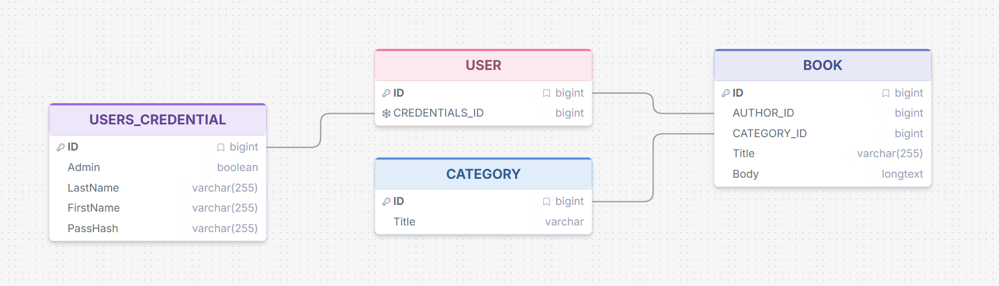

# KNYGU KATALOGAS

## Paruošimas

```sql
CREATE TABLE CREDENTIAL (
	ID int auto_increment PRIMARY KEY,
    Admin boolean NOT NULL,
    LastName nvarchar(255) NOT NULL,
    FirstName nvarchar(255) NOT NULL,
    PassHash nvarchar(255) NOT NULL
);

CREATE TABLE AUTHOR (
	ID int auto_increment PRIMARY KEY,
	CREDENTIALS_ID int NOT NULL,
    FOREIGN KEY (CREDENTIALS_ID) REFERENCES CREDENTIAL (ID)
);

CREATE TABLE CATEGORY (
	ID int auto_increment PRIMARY KEY,
    Title nvarchar(50) NOT NULL,
    Description nvarchar(255) NULL
);

CREATE TABLE BOOK (
	ID int auto_increment PRIMARY KEY,
    AUTHOR_ID int NOT NULL,
    CATEGORY_ID int NULL,
    Title nvarchar(50) NOT NULL,
    Body text NOT NULL,
    FOREIGN KEY (AUTHOR_ID) REFERENCES AUTHOR (ID),
    FOREIGN KEY (CATEGORY_ID) REFERENCES CATEGORY (ID)
);
```



## API ENDPOINTS
POST `/books` + {token:str, title:str, body:str, category:int} ->  
```
{
    {
        book_id:int
    }
}
```
POST `/books` + {token:str} ->  
```
{
    [
        { 
            book_id:int, 
            author:str, 
            title:str, 
            category:int 
        },

        {...}
    ]
}
```
POST `/books/{book_id}` + {token:str} ->  
```
{
    {
        book_id:int,
        author:str,
        title:str,
        category:int,
        body:str
    }
}
```
PUT `/books/{book_id}` + {token:str, title:str, body:str, category:int} ->  
```
{
    {
        book_id:int
    }
}
```
DELETE `/books/{book_id}` + {token:str} ->
```
{
    {
        book_id:int
    }
}
```
POST `/auth` + {user:str, password:str} ->  
```
{
    {
        token:str
    }
}
```